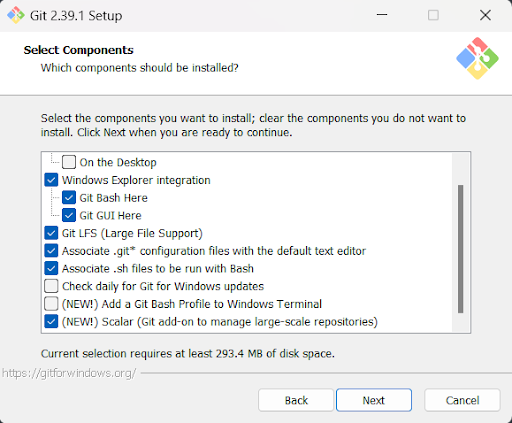
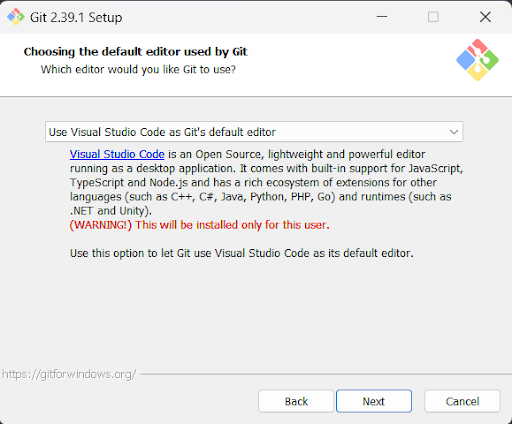
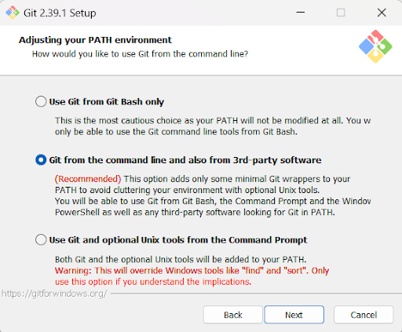
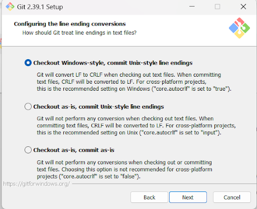
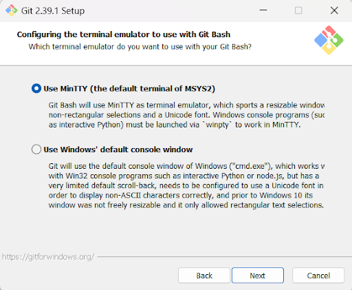
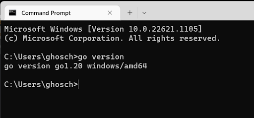
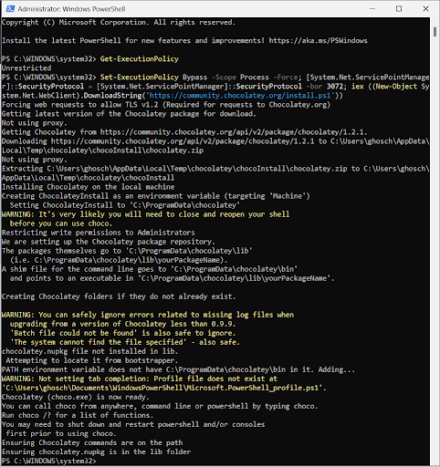
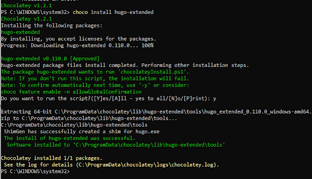
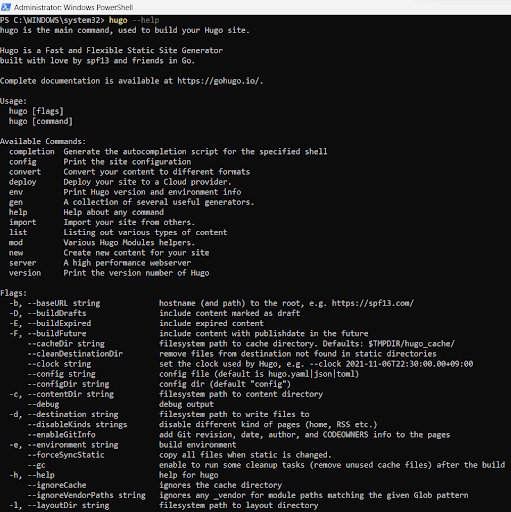

# Installing Hugo, and everything else needed

I am not going to lie, this is not going to be the funnest post, but its information dense and misison critical so it seems like a fitting first post. We need to get the functional out of the way to get to the funner stuff. 

We are going to make a static website using **Hugo** and hosting it on **Git**. The majority of this is outlined in the instructions here:
https://gohugo.io/installation/windows/  

I am using a package manager called **Chocolatey**. We will also need to make sure **Git** and **Go** are installed as well. The order of operations is as follows:


1. Install **Git**
2. Install **Go**
3. Install **Chocolatey**
4. Install **Hugo Extended**

<br>


## Install Git
---

	Git is a distributed version control system that tracks changes in any set of computer files, usually used for coordinating work among programmers collaboratively developing source code during software development.

<br>

We are going to install Git using these instructions:
https://git-scm.com/book/en/v2/Getting-Started-Installing-Git

<br>

We will need to go through a lot of set up screens to install Git, but these are mostly common sense and you'll really just need to select the default options.

For example, first up is a bunch of components. I left the default options and am only leaving this here just in case I need to remember what was installed later.



<br>

I like VS Code so I chose it as the default editor. 



<br>

This option seems to be the right one, it's reccommend afterall!



<br>

I have no idea what this means but it's the one on top, so let’s do it!



<br>

And a terminal emulator for good measure.



<br>


Now that we got through all those options, we have Git installed!
<br>
<br>

## Install Go
---
	Go is a statically typed, compiled high-level programming language designed at Google by Robert Griesemer, Rob Pike, and Ken Thompson. It is syntactically similar to C, but with memory safety, garbage collection, structural typing, and CSP-style concurrency.

<br>

We are going to install Go using these instructions:
https://go.dev/doc/install

<br>

Installing Go is much faster, we just download an MSI file from the link above and run it. Afterwards we can verify our version of Go:

	go version

<br>




<br>

## Install Chocolately
---

We need a package installer to install Hugo, I chose Chocolatey’s open source free version, found here:
https://chocolatey.org/install


<br>

First, I checked the Execution Policy on my system and found it was unrestricted, so I was then able to run the script to install Chocolatey below. But if the Execution poliicy is restricted follow the instructions above before running this script:

```bash
Set-ExecutionPolicy Bypass -Scope Process -Force; 
[System.Net.ServicePointManager]::SecurityProtocol = [System.Net.ServicePointManager]::SecurityProtocol -bor 3072; 
iex ((New-Object System.Net.WebClient).DownloadString('https://community.chocolatey.org/install.ps1'))
```

<br>

Wait a few minutes and Chocolately should be installed. You can check with: 

	choco 

or 

	choco -?
<br>



<br>
<br>

## Install Hugo Extended
---
	Hugo is a general-purpose website framework written in Go. Technically speaking, Hugo is a static site generator. Unlike systems that dynamically build a page with each visitor request, Hugo builds pages when you create or update your content. Since websites are viewed far more often than they are edited, Hugo is designed to provide an optimal viewing experience for your website’s end users and an ideal writing experience for website authors.

<br>

Using Chocolatey, we can then installed hugo-extended:

	choco install hugo-extended

<br>	





Ok, that's it, we installed Hugo, now let’s try and use it.

<br>
<br>

# Use Hugo to Create and Add Content to a Static Web Page

I followed along to this guide:
https://strapi.io/blog/guide-to-using-hugo-site-generator

Here is the github:
https://github.com/gohugoio/hugo

<br>


## Create Web Page
---
Using command prompt, input the following command:


```bash
hugo new site implied-belligerence
```
<br>


Because I want to call my web blog Implied Belligerence, first we call **hugo**, and give it the **new** command. We then tell it that we want a new **site** specifically. *We have to create a folder with the name we want to use, the command does not do that for you.*

Go to the directory you want your site hosted at, make a master folder that is the name of your site. For me this was:
```bash
C:\Users\ghosch\Documents\Hugo\implied-belligerence
```

<br>

With the site skeleton created, we can install a theme:

```bash
git init 
git submodule add https://github.com/SteveLane/hugo-icon.git themes/hugo-icon
```

<br>


And then:
```bash
hugo server -t hugo-icon --config themes/hugo-icon/exampleSite/config.toml
```

<br>


To view the page, you can go here: http://localhost:1313/

<br>


Let’s take a close look at that config file that is being loaded to display this site above. There is about 200 lines of code just for this page, so let’s just look at the beginning of the code. Notice the first two sections are setting up the theme to use for the config file, and then the meta data.

After that we get into the home section, a little navigation section etc. 

Never having written TOML before, I am able to to take a quick look at this and get the basic jist of what is going on here. I think I could easily adapt this, but I am looking for something similar I believe. I have alot of learning to do about this part.


<br>

## Adding a content to our static website
---

Here is the what the file structure looks like now. Notice the hidden .git folder created after we initialized in the earlier step. There is also the git modules file there now as well. 


