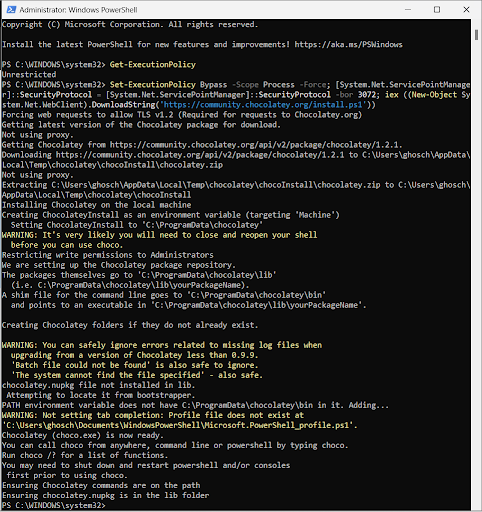

## this will work if image is another folder off root of markdown file

C:\Users\ghosch\Documents\Hugo\technology-implied-belligerence\technology-implied-belligerence\content\posts\staged_images\image_file_name.png

C:\Users\ghosch\Documents\Hugo\technology-implied-belligerence\technology-implied-belligerence\content\posts\tester_2.md

\
\
\
\

## this will work if image is in same folder as markdown file
\
\
\
\

## this will work for linking to images from the web

\
\
\
\

## I am still trying to figure out how to link to exact locations locally
